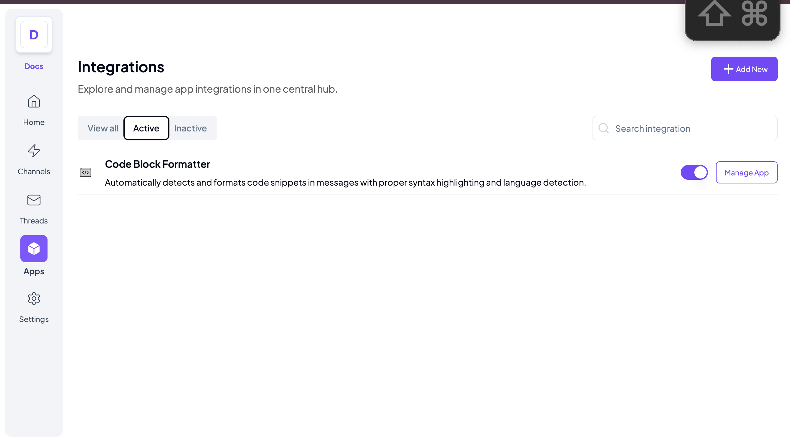

# Telex Code Block Formatter Integration

An automatic code block formatter integration for Telex that detects and properly formats code snippets in messages.

## Features
- **Automatic Code Formatting**: Wraps code snippets in proper markdown blocks.
- **Language Detection**: Identifies programming languages based on content.
- **Customizable Settings**: Allows configuration for minimum line detection.

## Public Deployment
This integration is deployed using render [code-block-formatter](https://telex-code-block-formatter.onrender.com)

## Local Development

### Prerequisites

-   Python 3.8 or higher
-   pip (Python package manager)
-   Git

### Setup

1.  Clone the repository:

bash

Copy

`git clone https://github.com/telex_integrations/code-formatter cd code-formatter`

2.  Create and activate virtual environment:

bash

Copy

`python -m venv venv source venv/bin/activate # On Windows, use: venv\Scripts\activate`

3.  Install dependencies:

bash

Copy

`pip install -r requirements.txt`

4.  Run locally:

bash

Copy

`uvicorn main:app --reload`

### sample test
bash

`curl -X POST "http://localhost:8000/format-message"
 -H "Content-Type: application/json"
 -d '{
 "channel_id": "0192dd70-cdf1-7e15-8776-4fee4a78405e",
 "settings": [
 {"label": "minLines", "type": "number", "default": 2, "required": true},
 {"label": "detectLanguage", "type": "boolean", "default": true, "required": true}
 ],
 "message": "def hello_world():\n print(\"Hello World!\")"
 }'`

### sample response
json
`{
"event_name": "message_formatted",
  "message": "```python\ndef hello_world():\n    print(\"Hello World!\")\n```",
  "status": "success",
  "username": "code-formatter-bot" 
}`


API Endpoints
-------------

### 1\. **Webhook Endpoint**

-   **URL**: `POST /webhook`
-   **Description**: Receives messages from Telex, formats them, and returns the formatted output.
-   **Request Body** (Example):

    json

    `{
      "event_name": "message_received",
      "message": "<p>function hello() {</p><p>console.log(\"Hello, Telex!\");</p><p>}</p>",
      "settings": [
        {"label": "minLines", "type": "number", "default": 2, "required": true},
        {"label": "detectLanguage", "type": "boolean", "default": true, "required": true}
      ]
    }`

-   **Response Example**:

    json

    `{
      "event_name": "message_formatted",
      "message": "```javascript\nfunction hello() {\nconsole.log(\"Hello, Telex!\");\n}\n```",
      "status": "success",
      "username": "code-formatter-bot"
    }`

### 2\. **Testing the API (cURL Example)**

To test the webhook locally:

bash

`curl -X POST "http://localhost:8000/webhook"\
     -H "Content-Type: application/json"\
     -d '{
       "event_name": "message_received",
       "message": "def hello_world():\n    print(\"Hello World!\")",
       "settings": [
         {"label": "minLines", "type": "number", "default": 2, "required": true},
         {"label": "detectLanguage", "type": "boolean", "default": true, "required": true}
       ]
     }'`

## setup in telex


Contributing
------------

Pull requests are welcome! For major changes, open an issue first to discuss proposed updates.

License
-------

MIT License